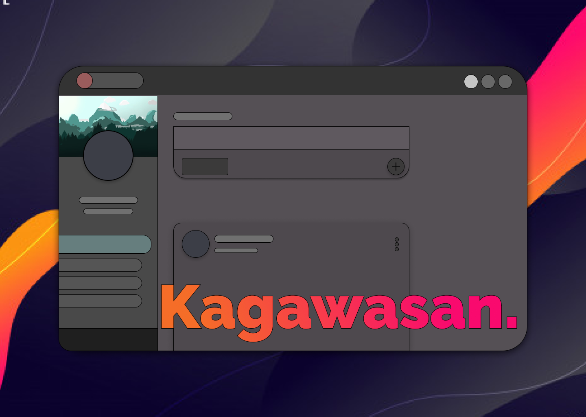

<p align="center">
  
</p>

Konishi's frontend written in Vue.js + Vuetify and Typescript. This is the responsive web application only. Zimmerman (The backend REST API written in Flask Python and RESTPlus) can be found [here.](https://github.com/konishi-project/zimmerman/) 

*Please remember that this is still in alpha so expect the code to be a bit all over the place, bugs, and glitches.*

Hear me out:
> Rewrites, rewrites, why the rewrites? The old Kagawasan was written in hacky methods which made the experience clunky and some of them needs changing, why not refactor the code? Refactoring the code would take as much time as rewriting it, Instead of rewriting, I think transfering the core logic and building off that is much better in the long run.
Rewriting will allow for better **scalability** and **maintainability**.
I will also make sure that this doesn't happen as often.

## Features

Kagawasan contains the usual UI/UX of most social platforms and aims to be much better.
You can learn more about how the components are written using the following documentations.

* [Vue.js](https://vuejs.org/) - The Progressive
JavaScript Framework
* [Vuetify](https://vuetifyjs.com/en/) - Material Design
Component Framework
* [Tachyons](https://tachyons.io/) - Create fast loading, highly readable, and 100% responsive interfaces with as little css as possible.

## Project setup
After cloning the repo, install the following dependencies using
```
yarn install
```

Compiles and hot-reloads for development
```
yarn run serve
```

To compile the application and minify it for production
```
yarn run build
```

## UI Preview Samples

_Coming Soon_
